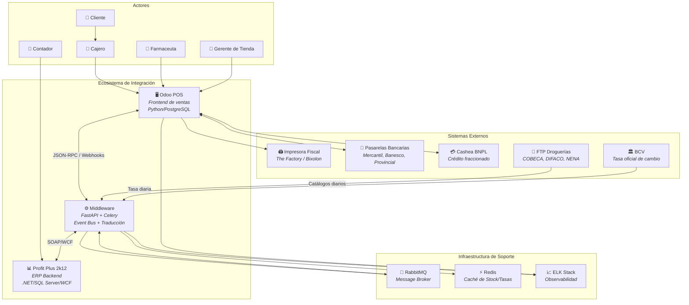
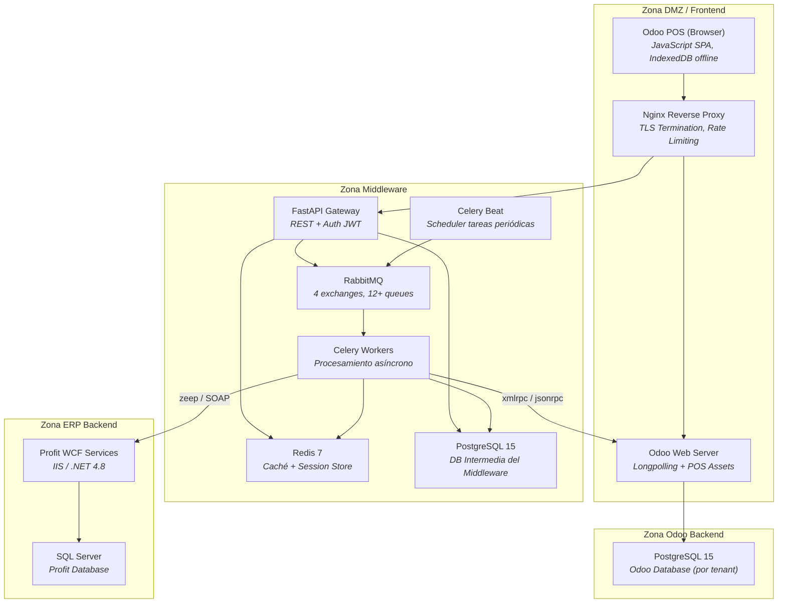
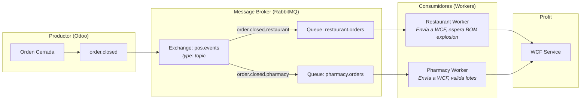
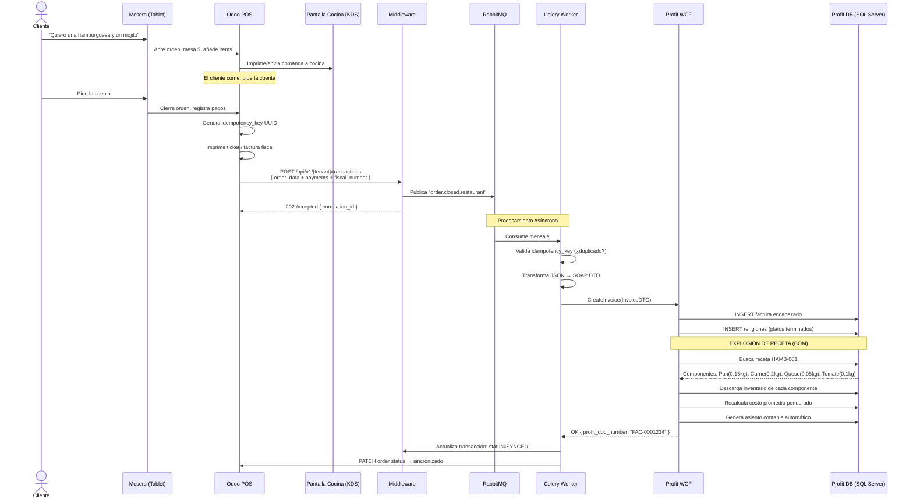
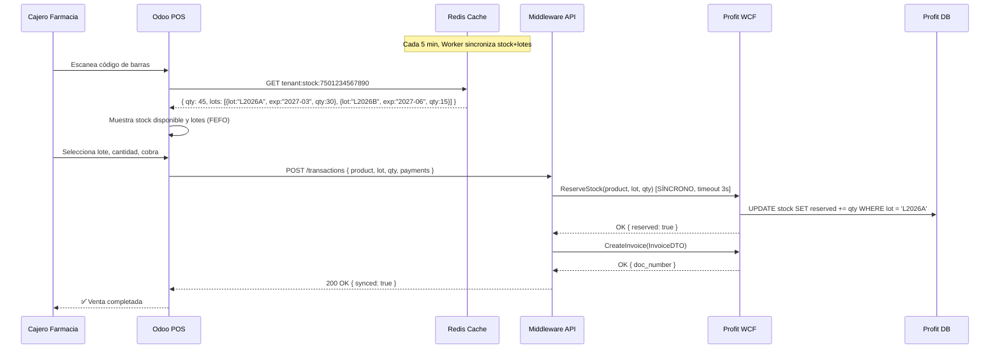
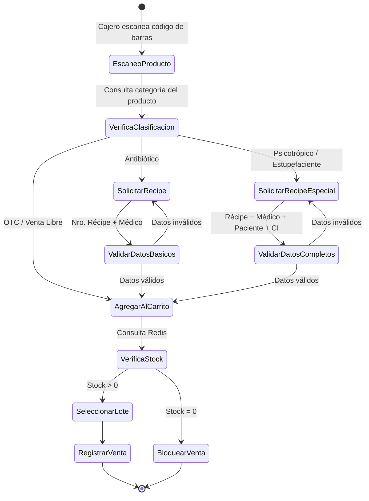
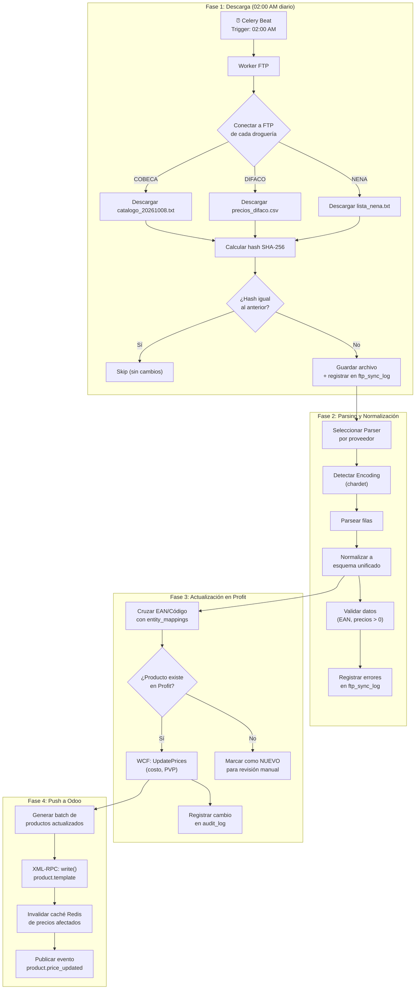
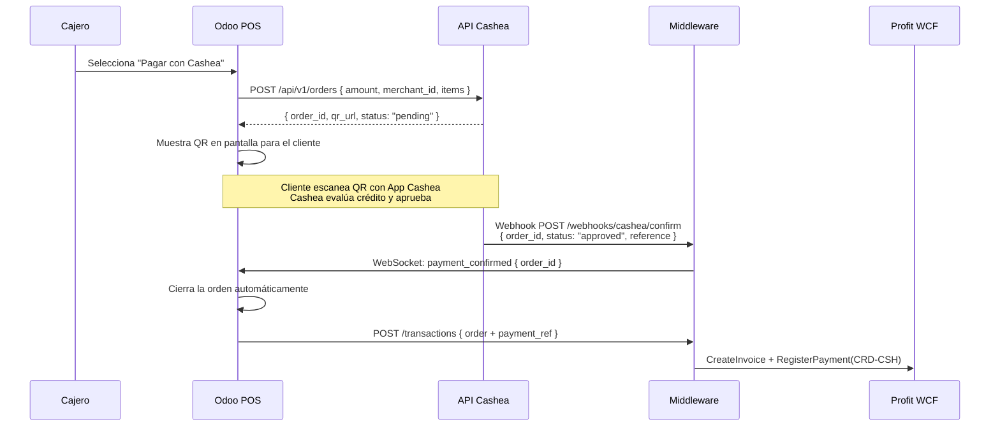
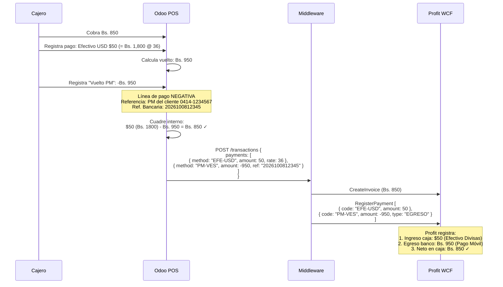
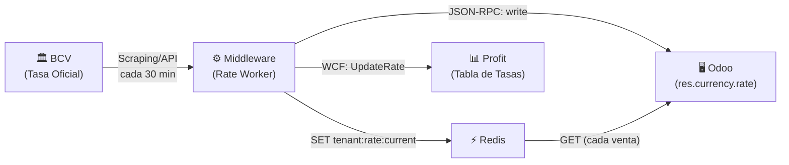

# Documento de Diseño de Arquitectura (ADD)

## Integración Odoo POS (Frontend) ↔ Profit Plus 2k12 (Backend ERP)

**Versión:** 2.0.0  
**Fecha:** Octubre 2026  
**Clasificación:** Confidencial — Equipo de Proyecto  
**Audiencia:** DBAs, Desarrolladores Backend/Frontend, Infraestructura, Gerencia IT  

> [!IMPORTANT]
> Este documento establece los fundamentos arquitectónicos, reglas de negocio, restricciones regulatorias y decisiones técnicas para la integración bidireccional entre **Odoo POS** y **Profit Plus 2k12**, adaptado a la realidad fiscal, operativa y monetaria de Venezuela. Cada sección explica el **porqué** de cada decisión, no solo el **qué**.

---

## Tabla de Contenidos

1. [Resumen Ejecutivo](#1-resumen-ejecutivo)
2. [Principios Arquitectónicos](#2-principios-arquitectónicos)
3. [Modelo Restaurante — Flujo Asíncrono](#3-modelo-restaurante--flujo-asíncrono)
4. [Modelo Farmacia — Síncrono / Retail Regulado](#4-modelo-farmacia--síncrono--retail-regulado)
5. [Integración B2B FTP (Droguerías)](#5-integración-b2b-ftp-droguerías)
6. [Pasarelas de Pago Externas](#6-pasarelas-de-pago-externas)
7. [Vuelto por Pago Móvil](#7-vuelto-por-pago-móvil)
8. [Tasa de Cambio por Documento](#8-tasa-de-cambio-por-documento)
9. [Descubrimiento Proactivo — Edge Cases Críticos](#9-descubrimiento-proactivo--edge-cases-críticos)
10. [Decisiones de Infraestructura](#10-decisiones-de-infraestructura)
11. [Glosario](#11-glosario)

---

## 1. Resumen Ejecutivo

### 1.1 Contexto del Proyecto

El ecosistema comercial venezolano impone desafíos únicos que no existen en otras latitudes:

- **Hiperinflación residual y multimoneda real:** Los precios se expresan simultáneamente en VES (Bolívares) y USD. Un cliente puede pagar con Zelle, efectivo dólares, Pago Móvil en bolívares y Cashea — todo en la misma transacción.
- **Regulación fiscal estricta e impredecible:** El SENIAT exige correlativos fiscales, máquinas fiscales, libros de compra/venta. El IGTF (3%) grava transacciones en divisas. El SUNDDE regula precios al consumidor.
- **Infraestructura de internet inestable:** Las caídas de conectividad son frecuentes. Un POS que se bloquea por falta de internet paraliza la caja y genera pérdidas directas.
- **Ecosistema ERP heredado:** Profit Plus 2k12, basado en .NET/SQL Server con servicios WCF, es el estándar de facto del retail venezolano. Tiene profunda localización fiscal pero una UX de punto de venta obsoleta.

Este proyecto nace de una necesidad clara: **aprovechar la UX moderna y las capacidades offline de Odoo POS como frontend de ventas**, manteniendo a **Profit Plus 2k12 como el motor contable, fiscal e inventarial de backend**.

### 1.2 Objetivos Estratégicos de Negocio

| Objetivo | Métrica de Éxito | Plazo |
|----------|-------------------|-------|
| Agilizar la operación de caja | Tiempo de cobro < 30 segundos | MVP |
| Cero pérdida de transacciones | 100% de órdenes POS aterrizan en Profit | MVP |
| Cumplimiento fiscal absoluto | 0 multas SENIAT por descuadre | Continuo |
| Soporte multimoneda nativo | Pagos mixtos VES/USD/EUR en 1 factura | MVP |
| Escalabilidad a nuevos verticales | Incorporar nuevo negocio en < 2 semanas | v2.0 |
| Operación offline | POS funcional sin internet por 4+ horas | MVP |

### 1.3 Stakeholders y Sus Preocupaciones

| Stakeholder | Preocupación Principal |
|-------------|----------------------|
| Gerencia Financiera | Conciliación exacta, cuadre de caja, libros fiscales |
| Contador / Auditor | Correlativos, retenciones IVA/ISLR, IGTF |
| Gerente de Tienda | Que la caja no se detenga nunca |
| Cajero | Interfaz rápida, pago mixto sin fricciones |
| Equipo IT | Estabilidad, monitoreo, deployments sin downtime |
| Farmaceuta | Trazabilidad de lotes, récipes, regulación |
| Chef / Cocina | Que la comanda llegue correcta |
| Proveedor (Droguería) | Integración FTP sin cambios en su lado |

### 1.4 Restricciones Regulatorias

- **SENIAT:** Servicio Nacional Integrado de Administración Aduanera y Tributaria. Exige: IVA (16% general, 8% reducido, exento), IGTF (3% a transacciones en divisas), correlativos fiscales (Nro. de Control), máquinas fiscales homologadas, libros de compra/venta electrónicos.
- **SUNDDE:** Superintendencia Nacional para la Defensa de los Derechos Socioeconómicos. Regula precios máximos de venta al público (PMVP), especialmente en alimentos y medicamentos. Exige que los precios se expresen en Bolívares a tasa BCV.
- **SUDEBAN:** Superintendencia de Bancos. Regula las pasarelas de pago, puntos de venta bancarios y transferencias electrónicas.
- **MPPPS / Contraloría Sanitaria:** Ministerio del Poder Popular para la Salud. Regula la venta de medicamentos controlados (psicotrópicos, antibióticos), exige retención de récipes, trazabilidad de lotes.
- **FENAHOVEN:** Federación Nacional de Asociaciones de Hogares y Viviendas. Regula márgenes de ganancia en farmacias.

### 1.5 Diagrama de Contexto (C4 — Level 1)



### 1.6 Diagrama de Contenedores (C4 — Level 2)



---

## 2. Principios Arquitectónicos

### 2.1 Arquitectura Hexagonal (Ports & Adapters)

**¿Por qué esta arquitectura y no MVC o N-Layer tradicional?**

La integración conecta **dos sistemas con tecnologías radicalmente distintas**: Odoo (Python, XML-RPC, JSON-RPC, PostgreSQL) y Profit (C#/.NET, WCF/SOAP, SQL Server). Si la lógica de negocio estuviera acoplada a cualquiera de estas tecnologías:

1. Un cambio en la API de Odoo (de XML-RPC a REST puro, como está ocurriendo en Odoo 17+) obligaría a reescribir reglas de negocio.
2. Si Profit migra de WCF a gRPC o REST, el impacto sería catastrófico.
3. Agregar un nuevo ERP (SAP Business One para una ferretería) requeriría duplicar toda la lógica.

**Con Hexagonal:** La lógica de dominio (conciliación, conversión de UoM, explosión de recetas) vive en el **Core**, aislada de los detalles de infraestructura. Los **Ports** definen contratos abstractos ("necesito enviar una factura al ERP") y los **Adapters** implementan el cómo ("vía WCF con SOAP XML" o "vía REST con JSON").

> [!TIP]
> **Regla de Oro:** Ninguna clase del Domain Core puede importar librerías de infraestructura (`zeep`, `xmlrpc`, `sqlalchemy`). Si lo hace, la arquitectura está rota.

### 2.2 Event-Driven Architecture (EDA) con Message Broker

**¿Por qué no REST síncrono directo entre Odoo y Profit?**

Tres razones concretas:

1. **Resiliencia ante caídas:** Si el WCF de Profit está abajo por mantenimiento o un bloqueo en SQL Server, una arquitectura síncrona detendría las ventas del POS. Con un Message Broker, Odoo publica el evento `order.closed` y sigue operando. El Worker lo consumirá cuando Profit vuelva.

2. **Desacoplamiento temporal:** El restaurante cierra 200 cuentas en hora pico (12:00-2:00 PM). Profit no necesita procesarlas en tiempo real. Puede consumirlas a su ritmo sin sobrecargar el WCF.

3. **Auditabilidad:** Cada mensaje queda en la cola con timestamp, correlation_id e idempotency_key. Si algo falla, hay trazabilidad completa.



### 2.3 Idempotencia Obligatoria en Todas las Operaciones

**¿Por qué es esto tan crítico en Venezuela?**

La inestabilidad de red hace que un mensaje pueda enviarse 2 o 3 veces. Sin idempotencia:

- Una factura se registra dos veces en Profit → el Libro de Ventas tiene un registro fantasma → multa del SENIAT.
- Un descuento de inventario se aplica dos veces → stock negativo fantasma → descuadre.
- Un pago se procesa dos veces → el cuadre de caja no cierra.

**Implementación:**
Cada transacción lleva un `idempotency_key` (UUID v4 generado por Odoo al cerrar la orden). El Middleware verifica en su tabla `transactions` si ya procesó esa key. Si sí, retorna el resultado original sin reejecutar.

```
idempotency_key: "pos_order_2026-10-08_CAJA01_00045"
```

### 2.4 Profit como Maestro Contable/Fiscal — Odoo como Frontend de Ventas

**¿Por qué no usar Odoo como ERP completo?**

1. **Localización fiscal:** Profit tiene 20+ años de desarrollo en la localización fiscal venezolana (retenciones, correlativos, libros, reconversiones). Replicar esto en Odoo tomaría años y tendría errores regulatorios.
2. **Base instalada:** Los contadores y auditores conocen Profit. Cambiar el ERP backend implicaría recapacitar a todo el departamento financiero.
3. **Integración con entes gubernamentales:** Los portales del SENIAT, SUNDDE y otros aceptan formatos nativos de Profit.
4. **Costo de migración:** Migrar historiales contables de 10+ años es riesgoso e innecesario.

**Flujo de maestría:**

| Dato | Maestro | Esclavo | Dirección de Sincronización |
|------|---------|---------|---------------------------|
| Productos / Artículos | Profit | Odoo | Profit → Middleware → Odoo |
| Precios (PVP, Costos) | Profit | Odoo | Profit → Middleware → Odoo |
| Stock por Almacén | Profit | Odoo (caché) | Profit → Redis → Odoo |
| Lotes y Vencimientos | Profit | Odoo | Profit → Middleware → Odoo |
| Clientes Corporativos | Profit | Odoo | Bidireccional |
| Ventas POS | Odoo (origen) | Profit (destino) | Odoo → Middleware → Profit |
| Pagos y Referencias | Odoo (captura) | Profit (concilia) | Odoo → Middleware → Profit |
| Tasa de Cambio | BCV → Middleware | Ambos | Middleware → Profit + Odoo |
| Correlativos Fiscales | Máquina Fiscal | Ambos | Fiscal → Odoo → Middleware → Profit |

### 2.5 Principio de Zero T-SQL Directo para Transacciones

**¿Por qué no escribir directamente en SQL Server de Profit?**

> [!CAUTION]
> **Nunca, bajo ninguna circunstancia, se debe insertar o actualizar directamente las tablas transaccionales de Profit Plus mediante sentencias T-SQL.** Profit tiene triggers, stored procedures y lógica embebida en su capa WCF que:
> - Genera correlativos automáticos.
> - Calcula impuestos compuestos.
> - Actualiza costos promedio ponderados.
> - Ejecuta la explosión de artículos compuestos (BOM).
> - Registra asientos contables automáticos.
>
> Saltarse esta capa y escribir directo en la BD produce inconsistencias que solo se descubren al momento de una auditoría fiscal.

**Única excepción:** Lecturas (`SELECT`) para consultas de stock, catálogo y reportes están permitidas vía vistas (`VIEW`) o procedimientos almacenados de solo lectura.

---

## 3. Modelo Restaurante — Flujo Asíncrono

### 3.1 Filosofía: Odoo como Catálogo "Ciego"

En el contexto de un restaurante, Odoo **no conoce los ingredientes** de un plato. Solo conoce el producto terminado ("Hamburguesa Premium", "Pizza Margarita", "Mojito").

**¿Por qué esta decisión?**

1. **Velocidad del POS:** La explosión de materiales (BOM) de una hamburguesa implica consultar 8-15 ingredientes, verificar stock de cada uno, calcular costos ponderados. Esto agregaría 2-5 segundos por línea de pedido — inaceptable en hora pico de un restaurante.
2. **Simplicidad para el mesero:** El mesero no necesita (ni debe) saber que el tomate se está agotando. Eso es responsabilidad del chef/almacenista.
3. **Lógica de costos centralizada:** Profit calcula el costo promedio ponderado de cada ingrediente. Duplicar esta lógica en Odoo crearía discrepancias contables.
4. **Recetas variables:** El chef puede cambiar la receta (más queso, menos pan) sin impactar el POS.

### 3.2 Flujo Completo: De la Mesa a la Contabilidad



### 3.3 Manejo de Propinas

En Venezuela, el "10% de servicio" (Service Charge) es diferente a la propina voluntaria:

| Concepto | Naturaleza | ¿Grava IVA? | Tratamiento en Profit |
|----------|-----------|-------------|----------------------|
| **Service Charge (10%)** | Obligatorio (calculado automáticamente) | **No** (no es precio de bienes ni servicios) | Artículo tipo "Servicio" sin impuesto, cuenta contable "Por Pagar al Personal" |
| **Propina Voluntaria** | Opcional (el cliente decide) | **No** | No se registra como ingreso de la empresa. Se maneja como fondo de terceros |

**Implementación en Odoo:**
- El Service Charge se agrega como una línea de producto automática al cerrar la orden.
- La propina voluntaria (si aplica) se registra como línea separada con impuesto 0% y categoría "Fondo de Empleados".

**En el Middleware:** Se deben mapear como dos líneas distintas en el DTO de Profit, con códigos de artículo y cuentas contables diferentes.

### 3.4 Merma de Cocina

La merma (ingredientes dañados, sobrantes del día, errores de preparación) **no pasa por Odoo**.

**¿Por qué?** Porque la merma es un ajuste de inventario interno que no tiene impacto en el POS. El chef o almacenista registra la merma directamente en Profit como un "Ajuste de Salida" o "Nota de Producción con Sobrante".

Sin embargo, el **Middleware debe sincronizar el stock resultante** hacia el caché de Redis para que Odoo tenga visibilidad actualizada (si se requiere alerta de stock bajo para el gerente).

### 3.5 Impuesto a Licores

> [!WARNING]
> Los licores y bebidas alcohólicas en Venezuela están sujetos a impuestos especiales además del IVA. El SENIAT aplica una **Contribución Especial sobre Precios Extraordinarios y Exorbitantes** (cuando aplique) y el **Impuesto sobre Alcohol y Especies Alcohólicas**.

**Implementación:**
- En Odoo: Se configuran impuestos compuestos (IVA 16% + Impuesto Especial a Licores) por categoría de producto.
- En Profit: Cada código de impuesto tiene su configuración. El Middleware debe mapear los impuestos de Odoo a los códigos exactos de Profit.
- Consideración especial: Los licores importados pueden tener tasas diferentes a los nacionales.

### 3.6 Cortesías y Descuentos por Gerente

| Tipo de Cortesía | Flujo en Odoo | Tratamiento en Profit |
|-------------------|--------------|----------------------|
| Cortesía total (100% descuento) | Descuento 100% con clave de gerente (PIN o huella) | Nota de Entrega sin impacto fiscal, o Factura con descuento 100% (según criterio del contador) |
| Descuento parcial (ej. 20%) | Descuento por línea con autorización | Factura normal con descuento por renglón |
| Consumo de casa | Producto especial "Consumo Interno" | Ajuste de salida por consumo interno |
| Degustación / Muestra | Línea con 100% descuento y motivo | Nota de Entrega categoría "Degustación" |

> [!NOTE]
> Toda cortesía debe quedar registrada con: quién la autorizó (gerente), motivo, y fecha/hora. Esto es crítico para auditoría interna y prevención de fraude.

### 3.7 Split de Cuentas y Pagos Parciales

Un escenario frecuente: mesa de 4 personas, cada uno paga su parte con método de pago diferente.

**Flujo:**
1. Mesero abre 1 orden para la mesa 5 con 8 ítems.
2. Al cerrar, el mesero "split" la orden en 4 sub-órdenes.
3. Cada sub-orden genera su propia línea de pago (Cliente A: Zelle $15, Cliente B: PM Bs. 500, etc.).
4. El Middleware envía cada sub-orden como una factura separada a Profit, o como una sola factura con múltiples formas de cobro (según configuración del tenant).

**Decisión arquitectónica:** Se recomienda enviar **una sola factura a Profit** con múltiples formas de cobro, ya que:
- Reduce el número de correlativos fiscales consumidos.
- Simplifica la conciliación.
- Profit soporta nativamente múltiples formas de cobro por factura.

### 3.8 Turnos, Mesas y Meseros

| Elemento | Vive en Odoo | Vive en Profit | Sincronización |
|----------|-------------|----------------|---------------|
| Mapa de mesas | ✅ (Floor plan) | ❌ | No se sincroniza |
| Asignación de mesero | ✅ | ❌ | No se sincroniza |
| Turno (sesión POS) | ✅ | ✅ (como cierre de caja) | Odoo → Middleware → Profit al cerrar turno |
| Comisión del mesero | ❌ | ✅ (nómina) | Middleware → Profit (% sobre venta) |

---

## 4. Modelo Farmacia — Síncrono / Retail Regulado

### 4.1 Diferencia Fundamental con Restaurante

A diferencia del restaurante donde la asincronía es aceptable (un plato vendido no se "devuelve" al inventario si Profit está caído), la farmacia requiere **validación síncrona** por dos razones:

1. **Regulación:** No se puede vender un medicamento vencido o sin lote trazable. La Contraloría Sanitaria puede clausurar la farmacia.
2. **Stock crítico:** Vender un antibiótico que no existe físicamente es un problema legal y de salud pública.

**Flujo híbrido adoptado:**
- El stock y los lotes se **pre-cachean en Redis** cada 5 minutos desde Profit.
- Odoo POS consulta el caché de Redis (< 5ms de latencia) para validar disponibilidad.
- Al vender, el Middleware reserva el stock en Profit de forma **síncrona** (timeout: 3 segundos).
- Si el WCF no responde en 3 segundos, se permite la venta con un flag `pending_stock_validation = true` para validación posterior.



### 4.2 Trazabilidad de Lotes y Vencimientos

**Obligatoriedad legal:** El MPPPS exige que todo medicamento vendido sea trazable hasta el lote de fabricación. En caso de un recall (retiro del mercado), la farmacia debe poder identificar a qué clientes vendió ese lote específico.

**Modelo de datos:**

```
Producto: Amoxicilina 500mg Cápsulas
├── Lote: L2026-A01 (Venc: 2027-03-15) → Stock: 30 cajas
├── Lote: L2026-B02 (Venc: 2027-06-20) → Stock: 15 cajas
└── Lote: L2025-Z99 (Venc: 2026-12-01) → Stock: 5 cajas ⚠️ PRÓXIMO A VENCER
```

**Política FEFO (First Expire, First Out):** Odoo debe sugerir automáticamente el lote con vencimiento más cercano (pero no vencido) al cajero. El cajero puede overridearlo manualmente si el lote físico en el estante es diferente.

> [!CAUTION]
> Si un lote tiene `expiry_date < TODAY`, el sistema **DEBE BLOQUEAR** la venta de ese lote. No es una advertencia, es un bloqueo duro. Un medicamento vencido vendido puede resultar en clausura de la farmacia y responsabilidad penal.

### 4.3 Conversiones de UoM Fraccionadas

Este es uno de los puntos más complejos de la integración. Las droguerías venden en Cajas. El cliente compra en Blísteres o incluso en pastillas individuales (unidades).

**Ejemplo concreto:**

```
Producto: Losartán 50mg Tabletas
  Unidad Principal (Profit): CAJA
  Factor de Conversión 1: 1 CAJA = 10 BLÍSTERES
  Factor de Conversión 2: 1 BLÍSTER = 10 TABLETAS
  Factor Total: 1 CAJA = 100 TABLETAS

Escenario de Venta:
  - Cliente compra 1 blíster (10 tabletas)
  - Profit debe descargar: 0.1 CAJAS del inventario
  - O en unidad alterna: 1 BLÍSTER

Stock actual en Profit: 5.3 CAJAS
  = 53 BLÍSTERES
  = 530 TABLETAS
```

**¿Dónde vive la tabla de conversión?**
En **Profit** (tabla `art_unid` o similar). El Middleware la sincroniza hacia Odoo donde se configura como UoM Category con ratios.

**Riesgo de precisión decimal:**
Cuando se vende 1 tableta de una caja de 100, Profit registra `0.01 CAJAS`. Después de 99 ventas individuales, debe quedar exactamente `0.01 CAJAS` (1 tableta), no `0.009999999...` por errores de punto flotante.

> [!IMPORTANT]
> **Mitigación:** Todas las operaciones de conversión de UoM deben usar `NUMERIC(20,8)` (SQL) o `Decimal` (Python) — **nunca `float`**. El Middleware debe hacer las conversiones con precisión arbitraria y enviar a Profit en la unidad que Profit espera.

### 4.4 Captura de Récipes Médicos (Psicotrópicos)

La regulación venezolana clasifica los medicamentos en:

| Clasificación | Requiere Récipe | Retención del Récipe | Ejemplos |
|---------------|----------------|---------------------|----------|
| **OTC** (Venta libre) | No | No | Acetaminofén, antiácidos |
| **Ético (no controlado)** | Sí (recomendado) | No | Antihipertensivos, antidiabéticos |
| **Antibiótico** | Sí (obligatorio) | No, pero se registra | Amoxicilina, Azitromicina |
| **Psicotrópico** | Sí (obligatorio, especial) | **Sí** (original retenido) | Clonazepam, Diazepam, Tramadol |
| **Estupefaciente** | Sí (receta especial triplicada) | **Sí** (original + copias al MPPPS) | Morfina, Oxicodona |

**Campos que Odoo POS debe capturar para controlados:**

```json
{
  "recipe_number": "REC-2026-004521",
  "doctor_name": "Dr. Juan Pérez",
  "doctor_license": "MPPS-12345",
  "medical_college": "Colegio de Médicos del Distrito Capital",
  "patient_name": "María García",
  "patient_id_type": "V",
  "patient_id_number": "12345678",
  "product_codes": ["PSI-CLONAZ-2MG", "PSI-DIAZE-10MG"],
  "is_retained": true,
  "retention_reason": "PSICOTROPICO",
  "captured_by": "CAJERO-003",
  "captured_at": "2026-10-08T14:30:00-04:00"
}
```

**Flujo en Odoo POS:**



### 4.5 Búsqueda por Principio Activo

Un cliente dice: "necesito algo para la presión con Losartán". El cajero debe poder buscar por **principio activo** ("losartan") y ver todas las presentaciones disponibles:

```
Búsqueda: "losartan"
Resultados:
├── Losartán 50mg Tab. x30 (Genérico Lab. Calox) → Stock: 45 → Bs. 15.00
├── Losartán 50mg Tab. x30 (Genérico Lab. VarPharm) → Stock: 20 → Bs. 14.50
├── Cozaar® 50mg Tab. x30 (Merck - Original) → Stock: 8 → Bs. 85.00
├── Losartán 100mg Tab. x30 (Genérico) → Stock: 12 → Bs. 22.00
└── Hyzaar® 50/12.5mg Tab. x30 (Losartán+HCTZ - Merck) → Stock: 5 → Bs. 120.00
```

**Implementación:**
- En Profit, el principio activo se almacena en campos adicionales o en una tabla custom `art_principio_activo`.
- El Middleware sincroniza esta información en un campo indexado de Odoo (`x_active_ingredient`).
- Odoo POS se modifica para buscar en `name`, `barcode`, `default_code` Y `x_active_ingredient`.

---

## 5. Integración B2B FTP (Droguerías)

### 5.1 Contexto del Problema

Las farmacias venezolanas se abastecen de droguerías mayoristas. Cada droguería publica diariamente su catálogo de productos disponibles con precios actualizados. Este catálogo es la fuente de verdad para:

- **Costos de reposición** (precio al que la farmacia compra).
- **PVP sugerido/regulado** (precio de venta al público, a veces regulado por SUNDDE).
- **Disponibilidad** (qué productos tienen en stock para despacho).

### 5.2 Proveedores Típicos y Sus Formatos

| Droguería | Formato | Encoding | Separador | Campos Notables |
|-----------|---------|----------|-----------|-----------------|
| COBECA | TXT fijo (columnas) | CP1252 | Posicional | Código EAN, Descripción, PVP, Costo, IVA |
| DIFACO | CSV | UTF-8 | Punto y coma | Código interno, EAN, Nombre, Precio base, IGTF |
| Droguería NENA | TXT | CP1252 | Pipe (|) | Código, Nombre, Lab, Principio Activo, PVP |
| DROCERCA | CSV | Latin-1 | Coma | SKU, EAN, Descripción, Costo, PVP, Stock disponible |
| FARMAPATRIA | XML | UTF-8 | N/A | Estructura propia, incluye lotes |

> [!WARNING]
> **Encoding:** La mayoría de las droguerías venezolanas usan CP1252 (Windows Latin-1), no UTF-8. El parser del Middleware **DEBE** detectar y convertir el encoding antes de procesar. Caracteres como `ñ`, `á`, `é` se corrompen si no se maneja correctamente.

### 5.3 Flujo Completo del Proceso Batch



### 5.4 Manejo de Productos Nuevos vs. Actualizaciones

- **Producto existente (ya mapeado):** Actualización automática de costo y PVP.
- **Producto nuevo (sin mapeo):** Se registra en una tabla `pending_products` para revisión manual por el farmaceuta. El farmaceuta decide si incorporarlo al catálogo, le asigna categoría, impuesto, y clasificación (OTC/Ético/Controlado). Solo entonces se crea en Profit y se sincroniza a Odoo.

**¿Por qué no crear automáticamente?** Porque un producto farmacéutico requiere clasificación regulatoria (¿es controlado? ¿requiere récipe?) que no viene en el archivo FTP de la droguería.

---

## 6. Pasarelas de Pago Externas

### 6.1 La Realidad Multimoneda de Venezuela

Un cliente típico puede pagar una cuenta de $100 así:

| Línea de Pago | Monto | Moneda | Método | Referencia |
|---------------|-------|--------|--------|-----------|
| 1 | $40.00 | USD | Zelle (transferencia) | Conf. #ZEL-9876543 |
| 2 | Bs. 1,080.00 | VES | Punto de Venta TDD Banesco | Lote: 45, Recibo: 0012 |
| 3 | $30.00 | USD | Cashea (BNPL 3 cuotas) | Order ID: CSH-2026-8877 |

Tasa del día: Bs. 36.00 / USD

Total en Bs: $40×36 + Bs.1080 + $30×36 = Bs.1440 + Bs.1080 + Bs.1080 = Bs.3600 ✓  
Total en USD: $100 ✓

### 6.2 Mapeo de Métodos de Pago (Odoo → Profit)

| Método de Pago (Odoo) | Código de Cobro (Profit) | Banco | Referencia Requerida | Moneda |
|------------------------|--------------------------|-------|---------------------|--------|
| Efectivo Bolívares | `EFE-VES` | N/A | Ninguna | VES |
| Efectivo Dólares | `EFE-USD` | N/A | Ninguna | USD |
| Efectivo Euros | `EFE-EUR` | N/A | Ninguna | EUR |
| TDD Mercantil | `TDD-MER` | 0105 | Lote + Recibo | VES |
| TDD Banesco | `TDD-BAN` | 0134 | Lote + Recibo | VES |
| TDD Provincial | `TDD-PRO` | 0108 | Lote + Recibo | VES |
| TDC Visa/MC Mercantil | `TDC-MER` | 0105 | Lote + Recibo + Últimos 4 | VES/USD |
| Pago Móvil (C2P) | `PM-VES` | Variable | Nro. Tel. + Ref. Bancaria | VES |
| Zelle | `DIV-ZEL` | N/A | Nro. Confirmación | USD |
| Transferencia Nacional | `TRF-VES` | Variable | Nro. Referencia | VES |
| Cashea (BNPL) | `CRD-CSH` | N/A | Order ID Cashea | USD |
| Binance Pay | `CRP-BIN` | N/A | TX Hash | USDT |
| Puntos de Fidelidad | `PTS-FID` | N/A | Nro. Tarjeta | N/A |

> [!IMPORTANT]
> Cada referencia bancaria debe llegar **exacta** a Profit. Si el lote del punto de venta es "045" y llega como "45", la conciliación bancaria automática fallará y el contador tendrá que cuadrar manualmente — multiplicado por 200+ transacciones diarias.

### 6.3 Integración BNPL (Cashea)



### 6.4 Pago Móvil C2P (Comercio a Persona)

El protocolo C2P permite al comercio iniciar el cobro desde su teléfono registrado. El banco del cliente le envía una notificación push y el cliente confirma.

**Flujo:**
1. Cajero selecciona "Pago Móvil" en Odoo.
2. Odoo muestra el número de teléfono del comercio y el monto en Bs.
3. El cliente confirma en su app bancaria.
4. La validación se hace por referencia bancaria que el cajero ingresa manualmente (los bancos venezolanos no tienen API pública de confirmación en tiempo real para todos los comercios).

---

## 7. Vuelto por Pago Móvil

### 7.1 El Problema de la Escasez de Efectivo

En Venezuela, el efectivo en bolívares es escaso. Los billetes de mayor denominación frecuentemente no alcanzan para dar vuelto. Y el efectivo en dólares tampoco tiene denominaciones pequeñas disponibles.

**Escenario real:**
- Cliente compra Bs. 850 en medicinas.
- Paga con un billete de $50 (equivalente a Bs. 1,800 a tasa 36).
- Vuelto: Bs. 950 (≈ $26.39).
- La farmacia no tiene Bs. 950 en efectivo ni $26.39 en billetes.
- **Solución:** La farmacia transfiere Bs. 950 al Pago Móvil del cliente.

### 7.2 Modelado en Odoo



### 7.3 Impacto en el Cuadre de Caja

Al cerrar el turno, el arqueo debe reflejar:

| Concepto | Monto |
|----------|-------|
| Ventas del día | Bs. 25,000 |
| Cobros en efectivo VES | Bs. 8,000 |
| Cobros en efectivo USD (equivalente) | Bs. 10,800 |
| Cobros por PM/Transferencia | Bs. 9,200 |
| **(-) Vueltos dados por PM** | **-Bs. 3,000** |
| **Total cobrado** | **Bs. 25,000** ✓ |

> [!TIP]
> En Profit, los egresos por vuelto PM deben ir a una cuenta transitoria "Vueltos por Pago Móvil" que se concilia al final del día con los movimientos bancarios reales.

---

## 8. Tasa de Cambio por Documento

### 8.1 El Problema

Venezuela tiene una tasa de cambio oficial publicada por el BCV (Banco Central de Venezuela) que cambia diariamente, generalmente entre 1:00 PM y 4:00 PM. Esto crea un escenario donde:

- A las 10:00 AM la tasa es Bs. 36.00/USD.
- A las 3:00 PM la tasa cambia a Bs. 36.50/USD.
- Una factura que se abrió a las 10:00 AM y se cobra a las 4:00 PM: ¿qué tasa usa?

**Odoo por defecto usa una tasa global** (`res.currency.rate`) que aplica a todas las transacciones del día. Esto es insuficiente porque:

1. Si la tasa cambia a mitad del día, las facturas de la mañana y de la tarde usan tasas diferentes.
2. El SUNDDE exige que los precios en bolívares reflejen la tasa BCV vigente al momento de la venta.
3. Profit necesita la tasa exacta de cada transacción para el asiento contable.

### 8.2 Solución: Tasa por Documento

**Modificación en Odoo:**
Se agrega un campo `x_custom_exchange_rate` a `pos.order` y `pos.order.line`. Al abrir una orden o al cobrar, Odoo obtiene la tasa vigente del Middleware (que a su vez la obtiene del caché Redis, alimentado por el BCV).

**Flujo de sincronización de tasa:**



**Payload al Middleware:**
```json
{
  "order_id": "POS/2026/10/08/0045",
  "exchange_rate": {
    "rate": 36.28500000,
    "source_currency": "USD",
    "target_currency": "VES",
    "captured_at": "2026-10-08T14:30:00-04:00",
    "source": "BCV"
  },
  "totals": {
    "total_usd": 27.50,
    "total_ves": 997.84,
    "tax_usd": 4.40,
    "tax_ves": 159.65
  }
}
```

### 8.3 Impacto en Reportes Contables

- **Libro de Ventas:** Cada factura muestra su tasa y montos en ambas monedas.
- **Diferencial Cambiario:** Si un pago se recibe días después (ej. crédito), la diferencia entre la tasa de la factura y la tasa del cobro genera una ganancia o pérdida cambiaria que Profit debe registrar automáticamente.
- **Reconversión:** La tasa histórica debe almacenarse en `NUMERIC(20,8)` para soportar futuras reconversiones monetarias (Venezuela ha tenido 3 en los últimos 10 años).

---

## 9. Descubrimiento Proactivo — Edge Cases Críticos

Estos son los "cisnes negros" operativos que, de no preverse, causarán incidentes en producción:

### 9.1 Correlativos Fiscales (Nro. de Control y Z-Report)

**Criticidad: 🔴 MÁXIMA**

El SENIAT exige que cada factura tenga un Número de Control correlativo, emitido por la máquina fiscal (impresora The Factory, Bixolon, o similar). Este número es **irrompible** — no puede haber saltos ni duplicados.

**Problema:** Odoo genera su propio correlativo de orden (`POS/2026/10/08/0001`), pero este NO es el correlativo fiscal. El correlativo fiscal lo genera la impresora al momento de imprimir.

**Solución:**
1. Odoo envía a imprimir y recibe de vuelta el Nro. de Control fiscal.
2. Este número se almacena en `x_fiscal_control_number` de la orden.
3. El Middleware lo envía a Profit como el `nro_control` de la factura.
4. **Race Condition:** Si dos cajas imprimen simultáneamente en la misma impresora fiscal, puede haber colisión. Se debe usar un semáforo (mutex) a nivel de impresora.

### 9.2 IGTF — Impuesto a Grandes Transacciones Financieras (3%)

**Criticidad: 🔴 MÁXIMA**

Desde 2022, toda transacción pagada en moneda extranjera (efectivo USD, Zelle, transferencia internacional) está gravada con un 3% adicional sobre el monto pagado en divisas.

**Ejemplo:**
- Compra: Bs. 3,600 ($100 @ 36)
- Pago: $60 en Zelle + Bs. 1,440 en PM
- IGTF: 3% × $60 = $1.80 (Bs. 64.80)
- Total a cobrar: $100 + $1.80 IGTF = $101.80

**Implementación:**
- Odoo calcula el IGTF al momento de registrar el pago en divisas (no antes, porque el monto en divisas puede cambiar).
- El IGTF se agrega como una línea de impuesto adicional en la factura.
- Profit debe recibirlo como un renglón fiscal separado con su código de impuesto específico.

### 9.3 Redondeo en Bolívares

**Criticidad: 🟡 MEDIA**

Con la eliminación de céntimos en la práctica (los billetes más pequeños son de Bs. 1), todos los montos en bolívares se redondean al bolívar más cercano. La diferencia se registra contablemente en una cuenta de "Ganancia/Pérdida por Redondeo".

### 9.4 Contingencia Offline (Caída de Internet)

**Criticidad: 🔴 MÁXIMA**

Odoo POS funciona offline gracias a IndexedDB en el navegador. Las ventas se acumulan localmente y se sincronizan al volver la conexión.

**Riesgos:**
- Las órdenes offline llegan batch al Middleware con fechas pasadas. Profit debe aceptar facturas con fecha retroactiva.
- Los correlativos fiscales offline pueden quedar desordenados temporalmente.
- El stock en caché puede estar desactualizado: se vendió un producto que ya no tiene stock.

**Mitigación:**
- El Middleware acepta órdenes con `created_at` hasta 24 horas en el pasado.
- Los correlativos se validan por secuencia, no por timestamp.
- El farmaceuta debe hacer un "stock check" al volver online para reconciliar.

### 9.5 Inventario Negativo

**Criticidad: 🟠 ALTA**

| Vertical | ¿Permite stock negativo? | Razón |
|----------|--------------------------|-------|
| Restaurante | ✅ Sí | El chef puede improvisar con ingredientes no registrados. La caja no se detiene por falta de tomate en el sistema. |
| Farmacia | ❌ No (por defecto) | Vender un medicamento inexistente es ilegal. |
| Farmacia | ⚠️ Excepcional con override | El farmaceuta puede autorizar con PIN si el producto está físicamente en el estante pero el sistema no lo refleja (error de conteo). |

### 9.6 Notas de Crédito y Devoluciones

**Criticidad: 🔴 MÁXIMA**

Una devolución requiere:
1. Referencia a la factura original (Nro. de Control fiscal).
2. Motivo de la devolución.
3. Autorización del gerente.
4. En farmacia: el producto devuelto NO regresa al inventario vendible si fue medicamento (se destruye o se devuelve al proveedor).
5. En restaurante: el plato devuelto es merma.

El Middleware debe enviar a Profit un `CreditNote` referenciando la factura original.

### 9.7 Retenciones de IVA e ISLR

**Criticidad: 🔴 MÁXIMA**

Clientes Jurídicos (empresas) clasificados como "Contribuyentes Especiales" por el SENIAT retienen:
- **75% o 100% del IVA** de la factura.
- **Porcentaje variable del ISLR** según el tipo de servicio/bien.

**Impacto en el POS:** La venta se registra normalmente, pero el cobro total es menor porque el cliente retiene una porción del IVA. Profit debe registrar la retención como "Cuenta por Cobrar - Retenciones" y generar el comprobante correspondiente.

### 9.8 Reconversión Monetaria

**Criticidad: 🟡 MEDIA (pero catastrófica si ocurre sin preparación)**

Venezuela ha tenido reconversiones monetarias en 2008 (÷1000), 2018 (÷100,000) y 2021 (÷1,000,000). Pueden ocurrir con poco aviso.

**Preparación:**
- Todas las tasas históricas deben almacenarse con su "era monetaria" (`VES`, `VEF`, `VEB`).
- La tabla `exchange_rates` tiene un campo `currency_era` para distinguir.
- El Middleware debe tener un "switch de reconversión" que ajuste factor de conversión globalmente sin tocar las transacciones históricas.

### 9.9 Diferencial Cambiario

Cuando un cliente paga a crédito y la tasa cambia entre la fecha de facturación y la fecha de cobro:
- Factura: $100 @ Bs. 36 = Bs. 3,600
- Cobro (5 días después): tasa Bs. 37 → el cliente paga Bs. 3,700
- Diferencia: Bs. 100 → Ganancia cambiaria

Profit maneja esto automáticamente en sus asientos contables, pero el Middleware debe enviar la tasa de cobro junto con la referencia del pago.

### 9.10 Combos y Promociones (2x1, 3x2)

**Criticidad: 🟡 MEDIA**

- Odoo maneja los combos como "Packs" o descuentos por regla de precios.
- Profit los maneja como kits o descuentos por línea.
- El Middleware debe traducir la representación de Odoo a la de Profit.

### 9.11 Programa de Puntos de Fidelidad

- Odoo maneja la acumulación y canje de puntos.
- Al canjear puntos, se genera una "venta" con forma de pago "Puntos" (sin movimiento bancario).
- Profit debe registrar esto como una factura con descuento 100% y forma de cobro especial `PTS-FID`.

### 9.12 Cierre de Turno / Cierre Z

Al cerrar turno en Odoo POS:
1. Se genera un reporte X (parcial) o Z (definitivo) con totales por forma de pago.
2. El cajero declara el efectivo contado físicamente.
3. La diferencia (sobrante/faltante) se registra.
4. El Middleware envía al Profit el cierre de caja con los totales.
5. Profit genera el movimiento de caja chica correspondiente.

### 9.13 Facturación Electrónica (SENIAT)

Aunque aún no es obligatoria para todos, el SENIAT está migrando hacia facturación electrónica. El sistema debe estar preparado para:
- Generar XML firmado digitalmente.
- Enviar al portal del SENIAT y recibir acuse.
- Almacenar el UUID fiscal.

### 9.14 Ventas a Crédito (Cuenta por Cobrar)

Un cliente corporativo puede llevarse productos y pagar después (30/60/90 días). Esto requiere:
- Identificación del cliente (RIF).
- Límite de crédito (validado contra Profit).
- Generación de factura sin cobro completo.
- El Middleware debe enviar la factura con saldo pendiente a Profit para gestión de cobranzas.

### 9.15 Arqueo de Caja y Prevención de Fraude

El sistema debe detectar anomalías:
- Exceso de cortesías por un cajero específico.
- Exceso de notas de crédito.
- Descuadres recurrentes en efectivo.
- Ventas anuladas después de impresas.

Estas alertas deben generarse en el Middleware y enviarse por notificación (email/Telegram) al gerente.

### 9.16 Bonificaciones y Muestras Médicas (Farmacia)

Los proveedores ofrecen bonificaciones: "Compra 10 cajas, te regalo 2". Las 2 cajas bonificadas:
- Entran al inventario con costo $0.
- Afectan el costo promedio ponderado.
- Profit maneja esto con "Notas de Recepción por Bonificación".
- Odoo no necesita saberlo (solo ve el stock actualizado).

### 9.17 Múltiples Monedas Base y Precisión Decimal

| Sistema | Moneda Base | Moneda Secundaria | Decimales |
|---------|-------------|-------------------|-----------|
| Profit | VES | USD | 2 (VES), 2 (USD) |
| Odoo | VES | USD | 2 (VES), 2 (USD) |
| Middleware | N/A (usa ambas) | N/A | 8 (interno) |

> [!CAUTION]
> Las operaciones intermedias del Middleware SIEMPRE usan 8 decimales para evitar errores acumulativos de redondeo. Solo se redondea al final, al enviar a Profit o Odoo, aplicando las reglas de redondeo de cada sistema.

---

## 10. Decisiones de Infraestructura

### 10.1 ¿Por qué RabbitMQ sobre Kafka?

| Criterio | RabbitMQ | Kafka |
|----------|----------|-------|
| Volumen esperado | ✅ Miles de msgs/día | Millones de msgs/seg |
| Complejidad operativa | ✅ Bajo (1 nodo basta para empezar) | Alta (requiere cluster ZooKeeper) |
| Enrutamiento inteligente | ✅ Exchanges, routing keys, bindings | Básico (solo topics) |
| Reintentos y DLQ | ✅ Nativo con plugins | Requiere implementación custom |
| Message ordering | ✅ Per-queue FIFO | Per-partition |
| Equipo disponible | ✅ El equipo conoce AMQP | Curva de aprendizaje alta |
| Costo de infraestructura | ✅ Bajo (< 2GB RAM) | Alto (mínimo 3 brokers) |

**Decisión:** RabbitMQ es la opción correcta para nuestro volumen y complejidad. Si en el futuro el negocio escala a 50+ sucursales con millones de eventos diarios, se puede migrar a Kafka sin tocar el Domain Core (gracias a la Arquitectura Hexagonal).

### 10.2 Redis como Caché de Stock

**¿Por qué no consultar Profit directamente?**

- Una consulta de stock vía WCF/SOAP toma 200-500ms.
- En farmacia, cada producto escaneado debe mostrar stock en <50ms.
- Redis responde en <5ms.

**Estrategia de invalidación:**
- Cada 5 minutos, un Worker sincroniza el stock completo de los productos "activos" (vendidos en los últimos 30 días).
- Cuando el Middleware procesa una venta, descuenta del caché en Redis inmediatamente (optimista).
- Si la transacción falla en Profit, se revierte el caché.
- Un cron nocturno hace reconciliación completa Redis vs. Profit.

### 10.3 Base de Datos Intermedia (PostgreSQL del Middleware)

**¿Por qué una BD intermedia y no escribir directo en Odoo o Profit?**

1. **Desacoplamiento:** Si Odoo está abajo, las transacciones en tránsito no se pierden.
2. **Auditabilidad:** Cada transacción tiene un ciclo de vida completo registrado (created → queued → processing → synced / failed).
3. **Multitenant:** Los datos de cada tenant están aislados lógicamente por `tenant_id`.
4. **Future-proof:** Agregar un nuevo vertical (ej. ferretería) es agregar un registro en `tenants`, no un nuevo deployment.

### 10.4 Deployment

**Para tiendas individuales (on-premise):**
- Docker Compose con todos los servicios en un servidor local.
- Resiste caídas de internet (opera localmente).
- Sincroniza con la nube cuando hay conectividad.

**Para cadenas (cloud):**
- Kubernetes con namespaces por tenant.
- Horizontal Pod Autoscaler para Workers en hora pico.
- PostgreSQL y SQL Server como servicios gestionados.

### 10.5 Monitoreo y Observabilidad

| Herramienta | Función | Alertas Configuradas |
|-------------|---------|---------------------|
| **Elasticsearch + Logstash + Kibana** | Centralización de logs estructurados (JSON) | Errores WCF, timeouts, parsing FTP fallidos |
| **Prometheus** | Métricas de sistema y aplicación | CPU > 80%, RAM > 90%, cola RMQ > 50 msgs |
| **Grafana** | Dashboards en tiempo real | Ventas/hora, tasa de éxito de sincronización, latencia WCF |
| **Sentry** | Tracking de excepciones | Cualquier excepción no manejada |
| **UptimeRobot / Healthchecks** | Disponibilidad de servicios | WCF down, Redis down, RabbitMQ down |

**Estructura de log (JSON):**
```json
{
  "timestamp": "2026-10-08T14:30:00.123Z",
  "level": "ERROR",
  "service": "transaction-worker",
  "tenant_id": "FARM-001",
  "correlation_id": "uuid-xxx",
  "event": "wcf_call_failed",
  "wcf_method": "CreateInvoice",
  "error_code": "TIMEOUT",
  "error_message": "WCF did not respond within 5000ms",
  "retry_count": 2,
  "next_retry_at": "2026-10-08T14:31:00Z",
  "payload_size_bytes": 4521,
  "duration_ms": 5001
}
```

---

## 11. Glosario

| Término | Definición |
|---------|-----------|
| **BCV** | Banco Central de Venezuela. Publica la tasa de cambio oficial diaria. |
| **BoM (Bill of Materials)** | Lista de materiales / receta. Define los componentes de un producto compuesto. |
| **C2P** | Cobro a Persona. Modalidad de Pago Móvil donde el comercio inicia el cobro. |
| **Cashea** | Plataforma venezolana de Buy Now, Pay Later (crédito fraccionado). |
| **Correlativo Fiscal** | Número secuencial obligatorio del SENIAT en cada factura (Nro. de Control). |
| **DLQ (Dead Letter Queue)** | Cola donde van los mensajes que fallan después de todos los reintentos. |
| **DTO** | Data Transfer Object. Estructura de datos para transferencia entre sistemas. |
| **EDA** | Event-Driven Architecture. Patrón donde los sistemas se comunican por eventos. |
| **FEFO** | First Expire, First Out. Política de despacho por fecha de vencimiento. |
| **FENAHOVEN** | Federación Nacional de Farmacias. Regula márgenes de ganancia. |
| **Hexagonal** | Arquitectura de Puertos y Adaptadores para aislar dominio de infraestructura. |
| **Idempotencia** | Propiedad de una operación que produce el mismo resultado si se ejecuta 1 o N veces. |
| **IGTF** | Impuesto a las Grandes Transacciones Financieras (3% en divisas). |
| **ISLR** | Impuesto Sobre la Renta. |
| **IVA** | Impuesto al Valor Agregado (16% general, 8% reducido, 0% exento). |
| **KDS** | Kitchen Display System. Pantalla de cocina para comandas. |
| **Máquina Fiscal** | Impresora homologada por SENIAT con memoria fiscal inalterable. |
| **MPPPS** | Ministerio del Poder Popular para la Salud. |
| **OTC** | Over The Counter. Medicamento de venta libre sin récipe. |
| **PM** | Pago Móvil. Sistema de pago interbancario venezolano vía celular. |
| **PMVP** | Precio Máximo de Venta al Público. Regulado por SUNDDE. |
| **Profit Plus 2k12** | ERP venezolano basado en .NET/SQL Server con servicios WCF. |
| **Psicotrópico** | Medicamento controlado que afecta el sistema nervioso central. Requiere récipe especial. |
| **RBAC** | Role-Based Access Control. Control de acceso basado en roles. |
| **Récipe** | Prescripción médica. Documento que autoriza la dispensación de medicamentos. |
| **SADA** | Servicio Autónomo de la Diversidad Biológica (importaciones de productos regulados). |
| **SENIAT** | Servicio Nacional Integrado de Administración Aduanera y Tributaria. |
| **SOAP** | Simple Object Access Protocol. Protocolo de servicios web usado por WCF. |
| **SUNDDE** | Superintendencia Nacional para la Defensa de los Derechos Socioeconómicos. |
| **SUDEBAN** | Superintendencia de Bancos. Regula instituciones financieras y medios de pago. |
| **TDD** | Tarjeta de Débito. |
| **TDC** | Tarjeta de Crédito. |
| **UoM** | Unit of Measure. Unidad de medida (Caja, Blíster, Unidad). |
| **WCF** | Windows Communication Foundation. Tecnología de servicios web .NET usada por Profit. |
| **Z-Report / Cierre Z** | Reporte fiscal diario totalizador que cierra la caja. Irrevocable e impreso por la máquina fiscal. |
| **Zelle** | Servicio de transferencia bancaria instantánea en USD (Wells Fargo, Chase, etc.). |

---

*Fin del Documento de Diseño de Arquitectura (ADD) — v2.0.0*  
*Última actualización: Octubre 2026*
